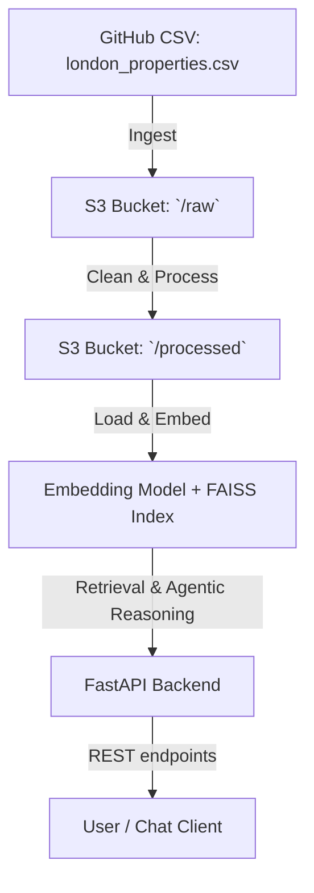
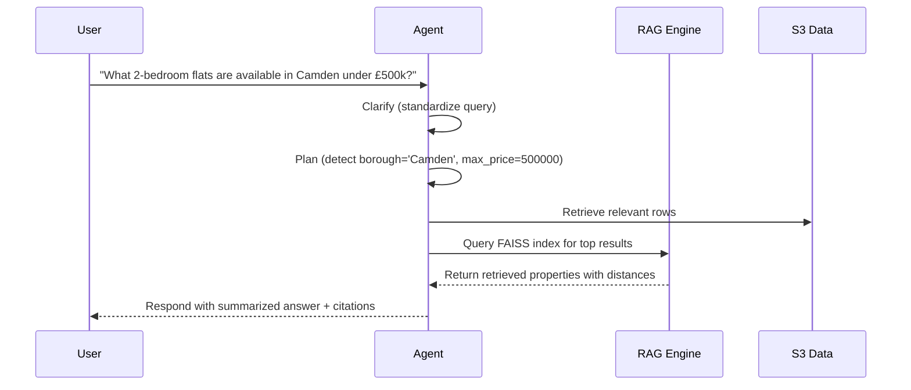
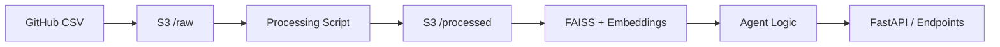

# London Real Estate RAG Agent  
_A mini agentic RAG pipeline for London real-estate data_

## 🔍 Project Overview  
This project builds a small end-to-end system that:  
- Ingests mock London real-estate data from a GitHub CSV → uploads to AWS S3 `/raw`  
- Cleans and processes the data → writes to S3 `/processed`  
- Builds embeddings + vector index → enables retrieval of property information with citations  
- Provides a RESTful backend (via FastAPI) with endpoints for ingestion, processing, querying, agentic reasoning, and visualization  
- Implements a simple agentic decision loop: clarify → plan → execute → respond  

##  Architecture Diagram  

## 📦 Folder Structure
```
london-rag-agent/
├── src/
│   ├── api/
│   │   └── main.py               ← FastAPI app with endpoints  
│   ├── rag/
│   │   ├── rag_engine.py        ← Embeddings, FAISS logic  
│   │   ├── agent_logic.py       ← Agentic loop (clarify-plan-execute-respond)  
│   │   └── utils.py             ← S3, loading utilities  
│   ├── ingest.py                ← Ingestion script (GitHub → S3 /raw)  
│   ├── process.py               ← Cleaning pipeline (S3 /raw → /processed)  
│   └── config.py                ← Configuration (AWS keys, S3 paths, model)  
├── data/                        ← Local cache: `faiss.index`, `embeddings.npy`, etc.  
├── .env                         ← Environment variables (not committed)  
└── README.md
```
## ⚙️ Setup Instructions

### 1 Clone Repository

```bash
git clone https://github.com/Poojitha319/london-rag-agent.git
cd london-rag-agent
```

### 2 Create .env File

Create a `.env` file in the root directory:

```
AWS_ACCESS_KEY_ID=your_access_key
AWS_SECRET_ACCESS_KEY=your_secret_key
AWS_REGION=us-east-1
S3_BUCKET=london-realestate-data
RAW_PREFIX=raw
PROCESSED_PREFIX=processed
RAW_KEY=raw/london_properties.csv
PROCESSED_KEY=processed/clean_properties.csv
EMBEDDING_MODEL=sentence-transformers/all-MiniLM-L6-v2
INDEX_PATH=data/faiss.index
META_PATH=data/faiss_meta.pkl
GITHUB_RAW_URL=https://raw.githubusercontent.com/Poojitha319/london-rag-agent/main/data/london_properties.csv
```


### 3️ Install Dependencies

```bash
pip install -r requirements.txt
```

### 4️ Run FastAPI Server

```bash
uvicorn src.api.main:app --reload --port 8000
```

Then visit [http://127.0.0.1:8000/docs](http://127.0.0.1:8000/docs) to interact with the API.

---

## 🔗 API Endpoints

| Endpoint      | Method | Description                                      |
|---------------|--------|--------------------------------------------------|
| `/health`     | GET    | Check API health                                 |
| `/ingest`     | POST   | Fetch data from GitHub → upload to S3 /raw       |
| `/process`    | POST   | Clean and process data → upload to S3 /processed |
| `/build-index`| POST   | Build FAISS index from processed data            |
| `/agent/run`  | POST   | Run agentic reasoning loop over data             |
| `/visualize`  | GET    | Return bar chart of properties by borough        |

---

## 🧠 Agentic Decision Flow



---

## 🧪 Example Query

**Input Query:**

```
What 2-bedroom flats are available in Camden under £500k?
```

**Agent Output:**

```json
{
	"steps": [
		{ "step": "clarify", "output": "Find cheap 2-bedroom flats in Camden under £500000" },
		{ "step": "plan", "output": { "filters": {"borough": "Camden", "max_price": 500000}, "tool": "filter" } },
		{ "step": "execute", "rows": 3 },
		{ "step": "respond", "output": {
				"answer": "Found properties:\n- 161 High Street (£325000, ID: P013)\n- 58 High Street (£475000, ID: P017)\n- 191 High Street (£475000, ID: P031)",
				"citations": ["P013", "P017", "P031"]
			}}
	],
	"final": {
		"answer": "Found properties:\n- 161 High Street (£325000, ID: P013)\n- 58 High Street (£475000, ID: P017)\n- 191 High Street (£475000, ID: P031)",
		"citations": ["P013", "P017", "P031"]
	}
}
```

---

## 🧾 Data Flow Summary



---
## 🧾 Results

This section shows where the pipeline writes artifacts and example verification steps you can use to confirm the repo is working.

- Local sample data: `data/london_properties.csv` (generated by `python -m src.generate_data`).
- Raw S3 key (when using S3): value of `RAW_KEY` from your `.env` (default: `raw/london_properties.csv`).
- Processed CSV (cleaned): uploaded to `PROCESSED_KEY` (default: `processed/clean_properties.csv`).
- FAISS index and metadata files (local):
	- Index: path configured by `INDEX_PATH` (default: `data/faiss.index`)
	- Metadata: path configured by `META_PATH` (default: `data/faiss_meta.pkl`)

Quick verification steps

1. After running `python -m src.process`, confirm the processed CSV exists locally or in S3. Locally:

```powershell
ls data\clean_properties.csv
```

2. After building the index (`/build-index` endpoint or equivalent script), confirm index files exist:

```powershell
ls data\*.index
ls data\*.pkl
```

3. Test a simple retrieval using the RAG module (example):

```powershell
python -c "from src.rag import RAG; RAG.load_index(); print(RAG.retrieve('2 bedroom flats in Camden under 500000', k=3))"
```

4. Check API responses for key endpoints (health, ingest, process, build-index, agent/run) using `curl` or the Swagger UI at `/docs`.

Expected example outputs

- `/health` → `{ "status": "ok" }`
- `/agent/run` (example query) → JSON with `steps` array and `final.answer` like the example in this README

If something is missing

- If processed CSV isn't present: re-run `python -m src.process` and inspect logs for errors.
- If FAISS index isn't built: ensure `sentence-transformers` model can be downloaded and `faiss` is installed (on Windows you may need `faiss-cpu` or run on Linux).
- 
## ✅ Features Checklist

| Feature                  | Status |
|--------------------------|--------|
| GitHub → S3 ingestion    | ✅     |
| Cleaning & processing    | ✅     |
| RAG + FAISS index        | ✅     |
| Agentic reasoning        | ✅     |
| FastAPI backend          | ✅     |
| AWS integration          | ✅     |

---


## 🧑‍💻 Author

Poojitha  
Built as part of an internship backend + data assessment task.  
📧 Contact: [GitHub Profile](https://github.com/Poojitha319)

---

## 📜 License

Licensed under the MIT License.  
You’re free to modify and use this project for educational or commercial purposes.
